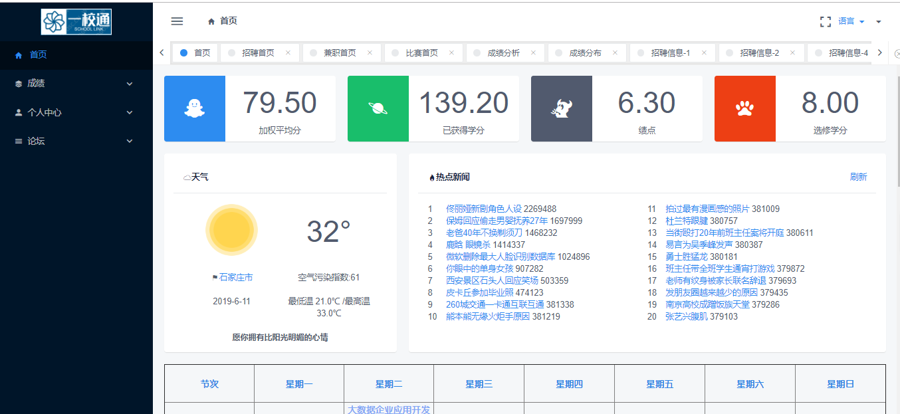
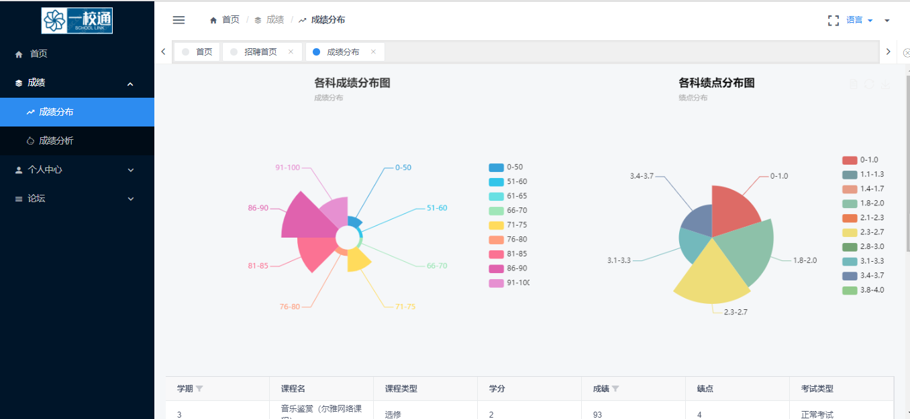
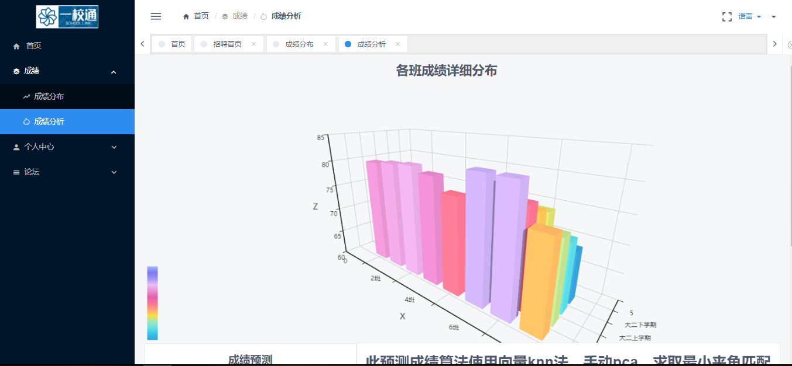
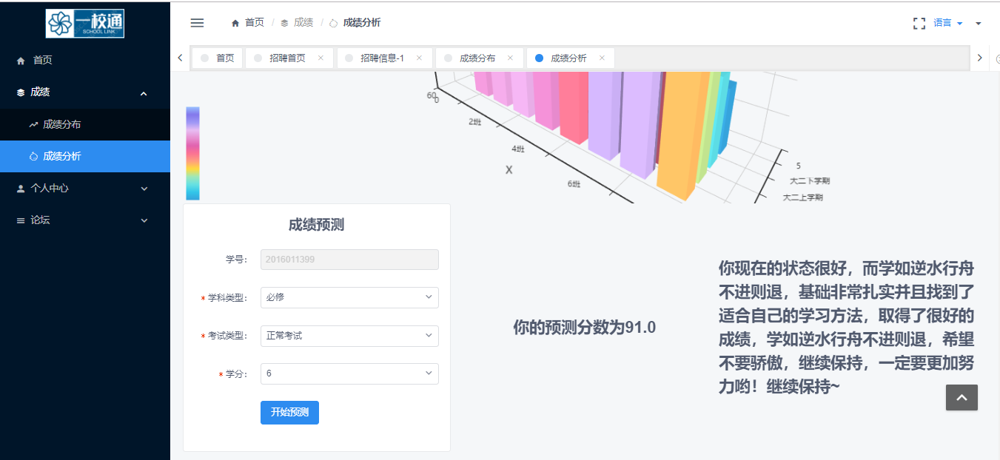
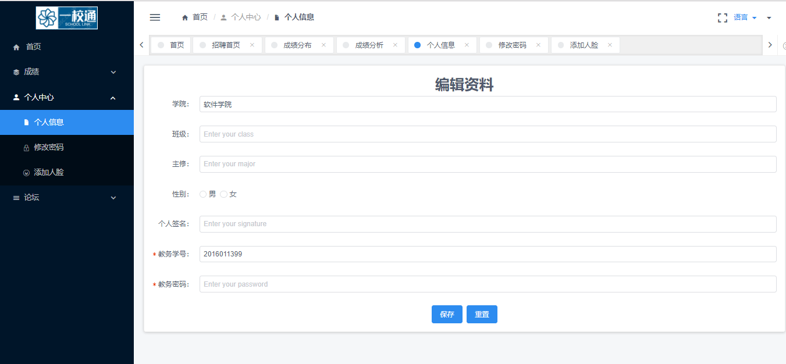
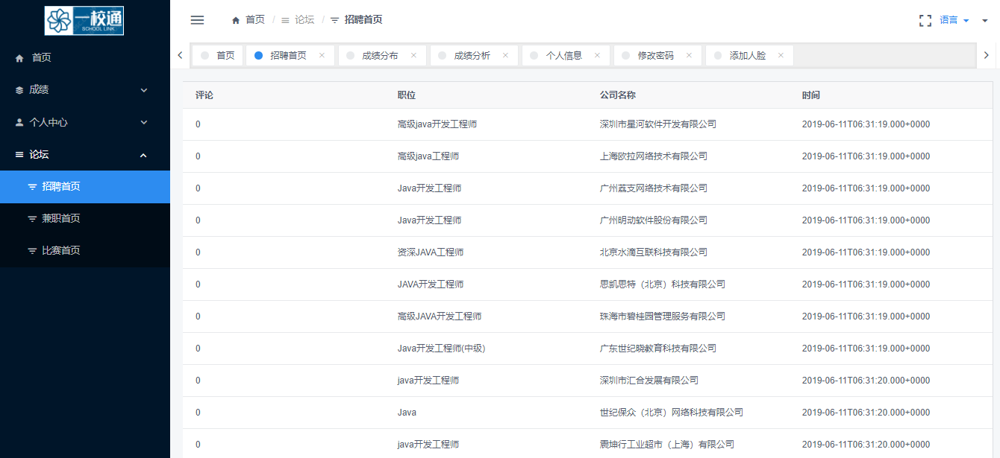
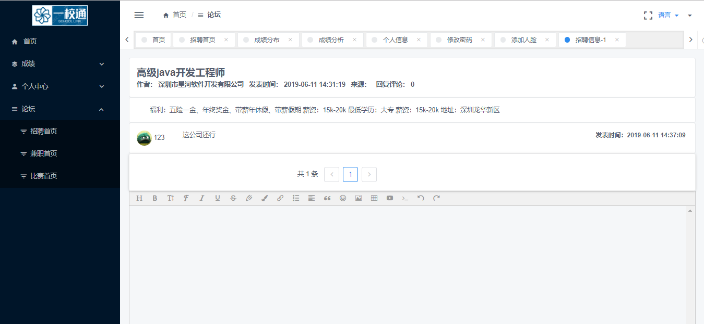

# 2016级项目实训成果展示 -
 
## 《校园信息平台》- Java与大数据分析

### 项目简介

本项目主要是为了给同学们提供一个便捷、条理清晰的信息服务平台，为同学们收集学习和生活方面的信息，并通过一定的处理和汇总，以简洁明了的方式向同学们展示这些信息。

### 项目地址
- Github：[https://github.com/guojinkang/school_Information](https://github.com/guojinkang/school_Information)

### 项目成员

- 郭金康（项目经理、UI设计师、开发工程师、测试工程师）
  - Email：[1473291402@qq.com](1473291402@qq.com) 
  - Github：[https://github.com/guojinkang](https://github.com/guojinkang)
- 袁云鹏（市场总监、UI设计师、开发工程师、测试工程师）
  - Email：[673105182@qq.com](mailto:673105182@qq.com)
  - Github：[https://github.com/jiachengyan](https://github.com/jiachengyan)
- 黄文旭（技术总监、UI设计师、开发工程师、测试工程师）
  - Email：[1551073921@qq.com](mailto:1551073921@qq.com)
  - Github：[https://github.com/nieliangpeng](https://github.com/nieliangpeng)
- 邬梓渌（技术总监、UI设计师、开发工程师、测试工程师）
  - Email：[2908673445@qq.com](mailto:2908673445@qq.com)
  - Github：[https://github.com/WangMing6ban](https://github.com/WangMing6ban)
- 李云洋（产品经理、UI设计师、开发工程师、测试工程师）
  - Email：[2396515252@qq.com](mailto:2396515252@qq.com)
  - Github：[https://github.com/ZhuoZm](https://github.com/ZhuoZm)
- 汪世昭（质量专家、UI设计师、开发工程师、测试工程师）
  - Email：[14703313561@163.com](mailto:14703313561@163.com)
  - Github：[https://github.com/yangxiaoyu98](https://github.com/yangxiaoyu98)
- 侯忠祺（质量专家、UI设计师、开发工程师、测试工程师）
  - Email：[14703313561@163.com](mailto:14703313561@163.com)
  - Github：[https://github.com/yangxiaoyu98](https://github.com/yangxiaoyu98)
- 黄军阳（质量专家、UI设计师、开发工程师、测试工程师）
  - Email：[14703313561@163.com](mailto:14703313561@163.com)
  - Github：[https://github.com/yangxiaoyu98](https://github.com/yangxiaoyu98)

  ### 项目截图
  
 

 
 
 
